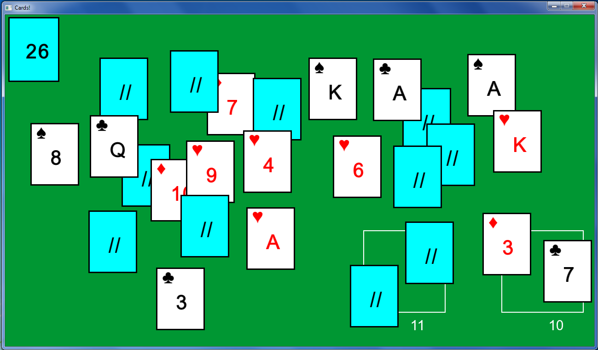

# CardTable
A simple deck of cards written in C#. Uses the SFML.NET library (partially included).

Default controls:
* Shuffle the deck with **Space**
* Randomly spill the deck with **S**
* Put all cards into the deck with **R**
* Flip all cards over with **F**

While dragging cards:
* Put the card back with **Left Ctrl**
* Flip the card over with **Left Shift**

Other settings:
* Use command-line arguments to set the resolution: **CardTable.exe** *width* *height*
* Edit **Utility.cs** to change the card sizes, background color, card back designs

